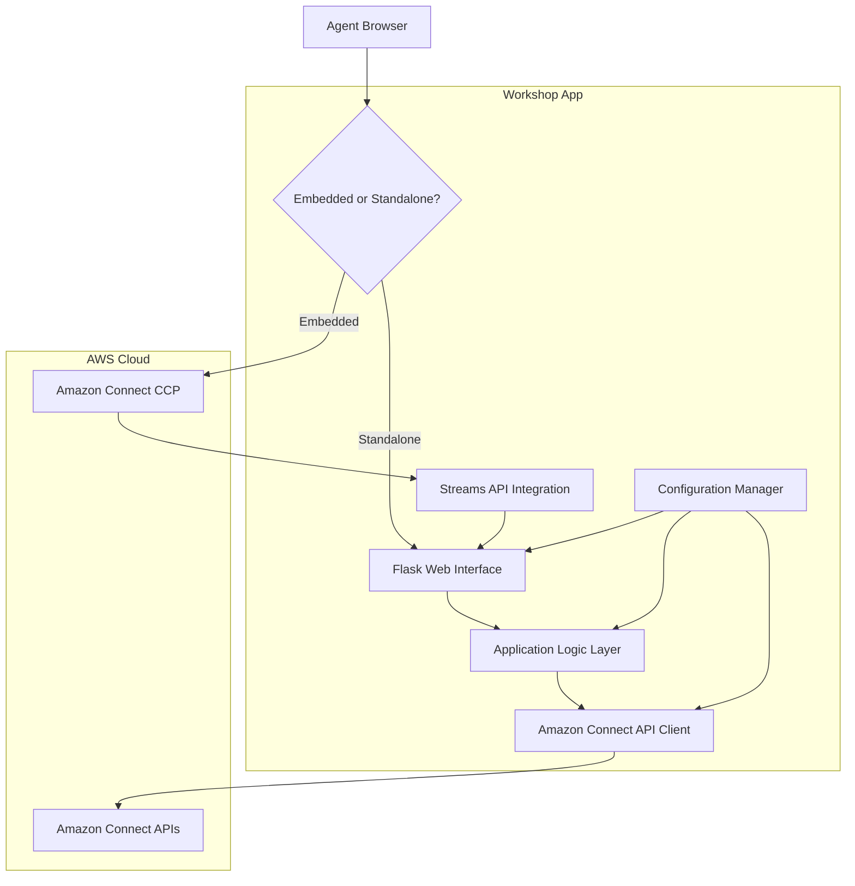
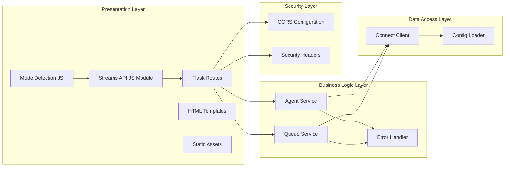
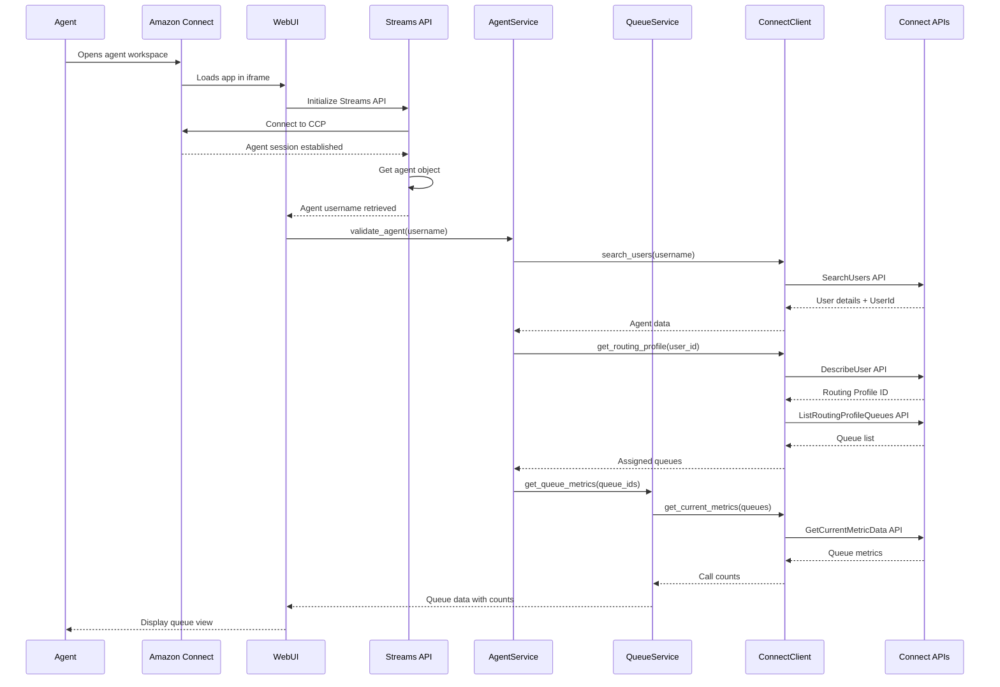
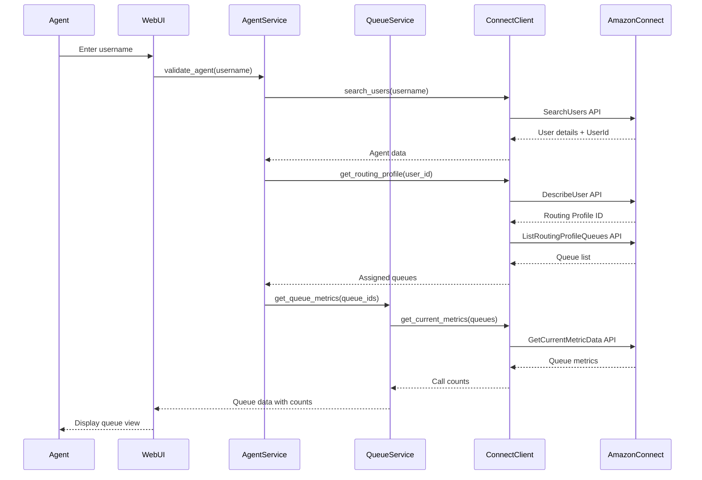

# Design Document: Amazon Connect Third-Party App Workshop

## Overview

This design document outlines the architecture and implementation approach for an educational workshop application that teaches developers how to build agent-focused web applications that can be embedded as third-party applications inside Amazon Connect's agent workspace. The application uses the Amazon Connect Streams API for automatic agent detection and the Amazon Connect Python SDK for retrieving queue information. It provides a personalized queue view for contact center agents, showing them the number of calls waiting in their assigned queues.

### Purpose

The workshop app serves dual purposes:
1. **Educational Tool**: Teaches developers progressive integration patterns including iframe embedding, Streams API usage, and SDK integration
2. **Functional Application**: Provides agents with a real-time view of their assigned queue workloads, accessible both within Amazon Connect and as a standalone tool

### Core Functionality

- **Dual Mode Operation**: Runs embedded in Amazon Connect agent workspace or standalone for development/testing
- **Automatic Agent Detection**: Uses Amazon Connect Streams API to automatically identify the logged-in agent when embedded
- **Manual Fallback**: Provides username input for standalone mode or when automatic detection fails
- **Queue Information Display**: Shows agent's assigned queues with current call counts
- **Manual Refresh**: Allows agents to update queue metrics on demand
- **Iframe Compatibility**: Properly configured security headers for embedding in Amazon Connect
- **Clear Error Handling**: User-friendly error messages and comprehensive logging

### Technology Stack

- **Backend**: Python 3.8+ with Flask web framework
- **Amazon Connect SDK**: boto3 (AWS SDK for Python)
- **Amazon Connect Streams API**: JavaScript library for agent workspace integration
- **Frontend**: HTML, CSS, JavaScript (vanilla - no framework dependencies)
- **Configuration**: Environment variables and config files
- **Deployment**: Local development server (workshop context), embeddable in Amazon Connect

### Design Principles

1. **Progressive Learning**: Architecture supports building the app in phases, from basic setup through iframe embedding to Streams API integration
2. **Separation of Concerns**: Clear boundaries between API client, business logic, presentation layers, and mode detection
3. **Beginner-Friendly**: Code patterns prioritize clarity and educational value over optimization
4. **Error Transparency**: Detailed error messages help participants understand SDK and Streams API behavior
5. **Workshop-Ready**: Includes comprehensive documentation, comments, and troubleshooting guides for both standalone and embedded modes
6. **Security-First**: Proper configuration of CORS, CSP, and iframe headers for secure embedding

## Architecture

### High-Level Architecture



### Component Architecture



### Request Flow Sequence

#### Embedded Mode (Automatic Agent Detection)



#### Standalone Mode (Manual Username Entry)



### Directory Structure

```
amazon-connect-workshop/
├── app/
│   ├── __init__.py              # Flask app initialization with CORS/headers
│   ├── routes.py                # Web routes and request handlers
│   ├── services/
│   │   ├── __init__.py
│   │   ├── agent_service.py     # Agent-related business logic
│   │   └── queue_service.py     # Queue metrics business logic
│   ├── clients/
│   │   ├── __init__.py
│   │   └── connect_client.py    # Amazon Connect API wrapper
│   ├── templates/
│   │   ├── index.html           # Agent login page (standalone mode)
│   │   └── queue_view.html      # Queue display page (both modes)
│   └── static/
│       ├── css/
│       │   └── styles.css
│       └── js/
│           ├── app.js           # Main application logic
│           ├── streams.js       # Streams API integration
│           └── mode-detector.js # Mode detection logic
├── config/
│   ├── __init__.py
│   ├── settings.py              # Configuration loader
│   └── .env.example             # Example environment variables
├── tests/
│   ├── __init__.py
│   ├── test_agent_service.py
│   ├── test_queue_service.py
│   ├── test_connect_client.py
│   ├── test_streams_integration.py
│   └── test_iframe_compatibility.py
├── docs/
│   ├── SETUP.md                 # Workshop setup instructions
│   ├── PHASE_1.md               # SDK installation guide
│   ├── PHASE_2.md               # Iframe compatibility setup
│   ├── PHASE_3.md               # Streams API integration
│   ├── PHASE_4.md               # Agent identification (auto + manual)
│   ├── PHASE_5.md               # Routing profile guide
│   ├── PHASE_6.md               # Queue metrics guide
│   ├── PHASE_7.md               # UI implementation guide
│   ├── PHASE_8.md               # Third-party app configuration
│   └── TROUBLESHOOTING.md       # Common issues and solutions
├── requirements.txt             # Python dependencies
├── .env                         # Environment variables (gitignored)
├── .gitignore
├── README.md                    # Workshop overview and learning path
└── run.py                       # Application entry point
```

## Components and Interfaces

### 1. Configuration Manager

**Purpose**: Centralized configuration management for AWS credentials and Connect instance settings.

**Module**: `config/settings.py`

**Responsibilities**:
- Load environment variables
- Validate configuration values
- Provide configuration access to other components
- Ensure sensitive data is not committed to version control

**Interface**:

```python
class Config:
    """Application configuration loaded from environment variables."""
    
    # AWS Configuration
    AWS_REGION: str
    AWS_ACCESS_KEY_ID: str  # Optional if using IAM roles
    AWS_SECRET_ACCESS_KEY: str  # Optional if using IAM roles
    
    # Amazon Connect Configuration
    CONNECT_INSTANCE_ID: str
    
    # Application Configuration
    FLASK_SECRET_KEY: str
    FLASK_DEBUG: bool
    
    @classmethod
    def validate(cls) -> tuple[bool, list[str]]:
        """Validate required configuration is present.
        
        Returns:
            Tuple of (is_valid, list_of_errors)
        """
        pass
    
    @classmethod
    def get_instance_id(cls) -> str:
        """Get the Connect instance ID with format validation."""
        pass
```

**Configuration File Format** (`.env`):

```
AWS_REGION=us-east-1
CONNECT_INSTANCE_ID=xxxxxxxx-xxxx-xxxx-xxxx-xxxxxxxxxxxx
CONNECT_INSTANCE_URL=https://your-instance.my.connect.aws
FLASK_SECRET_KEY=your-secret-key-here
FLASK_DEBUG=True
ALLOWED_ORIGINS=https://your-instance.my.connect.aws,https://your-instance.awsapps.com
```

### 2. Iframe Compatibility and Security Configuration

**Purpose**: Configure Flask application to allow secure embedding in Amazon Connect agent workspace.

**Module**: `app/__init__.py`

**Responsibilities**:
- Configure Content Security Policy (CSP) headers for iframe embedding
- Set X-Frame-Options or frame-ancestors directive
- Configure CORS to allow requests from Amazon Connect domains
- Handle session cookies in iframe context
- Detect embedded vs standalone mode

**Interface**:

```python
class SecurityConfig:
    """Security configuration for iframe embedding."""
    
    @staticmethod
    def configure_app(app: Flask, allowed_origins: list[str]):
        """Configure Flask app for iframe embedding.
        
        Args:
            app: Flask application instance
            allowed_origins: List of allowed Amazon Connect domain origins
        """
        pass
    
    @staticmethod
    def set_iframe_headers(response):
        """Set security headers on response for iframe compatibility.
        
        Args:
            response: Flask response object
            
        Returns:
            Modified response with security headers
        """
        pass
    
    @staticmethod
    def configure_cors(app: Flask, allowed_origins: list[str]):
        """Configure CORS for cross-origin requests.
        
        Args:
            app: Flask application instance
            allowed_origins: List of allowed origins
        """
        pass

# Flask app initialization with security configuration
def create_app():
    """Create and configure Flask application."""
    app = Flask(__name__)
    
    # Load configuration
    app.config.from_object(Config)
    
    # Configure security for iframe embedding
    allowed_origins = Config.ALLOWED_ORIGINS.split(',')
    SecurityConfig.configure_app(app, allowed_origins)
    SecurityConfig.configure_cors(app, allowed_origins)
    
    # Add after_request handler for security headers
    @app.after_request
    def add_security_headers(response):
        return SecurityConfig.set_iframe_headers(response)
    
    return app
```

**Security Headers Configuration**:

```python
def set_iframe_headers(response):
    """Configure headers for iframe embedding."""
    # Allow embedding from Amazon Connect domains
    # Use CSP frame-ancestors instead of X-Frame-Options for better control
    allowed_origins = Config.ALLOWED_ORIGINS.split(',')
    frame_ancestors = ' '.join(allowed_origins)
    
    response.headers['Content-Security-Policy'] = (
        f"frame-ancestors {frame_ancestors}; "
        "default-src 'self'; "
        "script-src 'self' 'unsafe-inline' https://connect.us-east-1.amazonaws.com; "
        "style-src 'self' 'unsafe-inline'; "
        "connect-src 'self' https://*.amazonaws.com"
    )
    
    # Set SameSite cookie policy for iframe context
    response.headers['Set-Cookie'] = 'SameSite=None; Secure'
    
    return response
```

**CORS Configuration**:

```python
from flask_cors import CORS

def configure_cors(app: Flask, allowed_origins: list[str]):
    """Configure CORS for Amazon Connect domains."""
    CORS(app, 
         origins=allowed_origins,
         supports_credentials=True,
         allow_headers=['Content-Type', 'Authorization'],
         methods=['GET', 'POST', 'OPTIONS'])
```

### 3. Mode Detection

**Purpose**: Detect whether the application is running in embedded mode (within Amazon Connect iframe) or standalone mode.

**Module**: `static/js/mode-detector.js`

**Responsibilities**:
- Detect if application is loaded in an iframe
- Determine if parent frame is Amazon Connect
- Set application mode flag
- Trigger appropriate initialization flow

**Interface**:

```javascript
class ModeDetector {
    /**
     * Detect application mode (embedded vs standalone).
     * @returns {Object} Mode information
     */
    static detectMode() {
        const isInIframe = window.self !== window.top;
        const isAmazonConnect = this.isAmazonConnectParent();
        
        return {
            isEmbedded: isInIframe && isAmazonConnect,
            isStandalone: !isInIframe || !isAmazonConnect,
            inIframe: isInIframe,
            parentIsConnect: isAmazonConnect
        };
    }
    
    /**
     * Check if parent frame is Amazon Connect.
     * @returns {boolean} True if parent is Amazon Connect
     */
    static isAmazonConnectParent() {
        try {
            // Check if we can access parent and if it has Connect indicators
            if (window.self === window.top) {
                return false;
            }
            
            // Check parent URL (may be blocked by CORS)
            const parentUrl = document.referrer;
            return parentUrl.includes('my.connect.aws') || 
                   parentUrl.includes('awsapps.com');
        } catch (e) {
            // If we can't access parent, assume not Connect
            console.warn('Cannot determine parent frame:', e);
            return false;
        }
    }
    
    /**
     * Initialize application based on detected mode.
     */
    static initializeApp() {
        const mode = this.detectMode();
        console.log('Application mode:', mode);
        
        if (mode.isEmbedded) {
            console.log('Running in embedded mode - initializing Streams API');
            return 'embedded';
        } else {
            console.log('Running in standalone mode - showing login form');
            return 'standalone';
        }
    }
}
```

### 4. Amazon Connect Streams API Integration

**Purpose**: Integrate Amazon Connect Streams JavaScript API to automatically detect logged-in agent.

**Module**: `static/js/streams.js`

**Responsibilities**:
- Load and initialize Amazon Connect Streams API
- Connect to Contact Control Panel (CCP)
- Retrieve current agent information
- Extract agent username
- Handle Streams API errors and fallback to manual input
- Provide agent state monitoring (optional enhancement)

**Interface**:

```javascript
class StreamsAPIIntegration {
    constructor(ccpUrl, containerDiv) {
        this.ccpUrl = ccpUrl;
        this.containerDiv = containerDiv;
        this.agent = null;
        this.initialized = false;
    }
    
    /**
     * Initialize Streams API connection.
     * @returns {Promise<Object>} Agent information
     */
    async initialize() {
        return new Promise((resolve, reject) => {
            const timeout = setTimeout(() => {
                reject(new Error('Streams API initialization timeout'));
            }, 10000);
            
            try {
                // Initialize Amazon Connect Streams
                connect.core.initCCP(this.containerDiv, {
                    ccpUrl: this.ccpUrl,
                    loginPopup: false,
                    softphone: {
                        allowFramedSoftphone: true
                    }
                });
                
                // Subscribe to agent events
                connect.agent((agent) => {
                    clearTimeout(timeout);
                    this.agent = agent;
                    this.initialized = true;
                    
                    const agentData = this.extractAgentData(agent);
                    resolve(agentData);
                });
                
            } catch (error) {
                clearTimeout(timeout);
                reject(error);
            }
        });
    }
    
    /**
     * Extract agent data from Streams API agent object.
     * @param {Object} agent - Streams API agent object
     * @returns {Object} Extracted agent data
     */
    extractAgentData(agent) {
        const config = agent.getConfiguration();
        const username = config.username;
        const agentARN = config.agentARN;
        const routingProfile = config.routingProfile;
        
        return {
            username: username,
            agentARN: agentARN,
            routingProfileARN: routingProfile?.routingProfileARN,
            routingProfileName: routingProfile?.name
        };
    }
    
    /**
     * Get current agent username.
     * @returns {string|null} Agent username or null if not available
     */
    getAgentUsername() {
        if (!this.agent) {
            return null;
        }
        
        const config = this.agent.getConfiguration();
        return config.username;
    }
    
    /**
     * Check if Streams API is initialized and agent is available.
     * @returns {boolean} True if initialized
     */
    isInitialized() {
        return this.initialized && this.agent !== null;
    }
    
    /**
     * Subscribe to agent state changes (optional enhancement).
     * @param {Function} callback - Called when agent state changes
     */
    onAgentStateChange(callback) {
        if (!this.agent) {
            console.warn('Cannot subscribe to state changes: agent not initialized');
            return;
        }
        
        this.agent.onStateChange((agentStateChange) => {
            callback(agentStateChange);
        });
    }
}
```

**Streams API HTML Integration**:

```html
<!-- In queue_view.html -->
<script src="https://connect.us-east-1.amazonaws.com/connect/static/connect-streams-min.js"></script>
<script src="{{ url_for('static', filename='js/mode-detector.js') }}"></script>
<script src="{{ url_for('static', filename='js/streams.js') }}"></script>

<script>
    // Initialize based on mode
    const mode = ModeDetector.initializeApp();
    
    if (mode === 'embedded') {
        // Hidden CCP container (required by Streams API but not displayed)
        const ccpContainer = document.getElementById('ccp-container');
        const ccpUrl = '{{ config.CONNECT_INSTANCE_URL }}/ccp-v2';
        
        const streams = new StreamsAPIIntegration(ccpUrl, ccpContainer);
        
        streams.initialize()
            .then(agentData => {
                console.log('Agent detected:', agentData.username);
                // Automatically load queue view for this agent
                loadQueueView(agentData.username);
            })
            .catch(error => {
                console.error('Streams API initialization failed:', error);
                // Fallback to manual username input
                showManualLoginForm();
            });
    } else {
        // Standalone mode - show manual login form
        showManualLoginForm();
    }
</script>
```

### 5. Amazon Connect API Client

**Purpose**: Low-level wrapper around boto3 Amazon Connect API calls with error handling.

**Module**: `app/clients/connect_client.py`

**Responsibilities**:
- Initialize boto3 Connect client with proper credentials
- Execute Amazon Connect API calls
- Handle AWS-specific errors and translate to application errors
- Provide retry logic for transient failures
- Log API calls for debugging

**Interface**:

```python
class ConnectClient:
    """Wrapper for Amazon Connect boto3 client."""
    
    def __init__(self, instance_id: str, region: str):
        """Initialize Connect client.
        
        Args:
            instance_id: Amazon Connect instance ID
            region: AWS region
        """
        pass
    
    def search_users(self, username: str) -> dict:
        """Search for a user by username.
        
        Args:
            username: Agent username to search for
            
        Returns:
            User data including UserId, Username, RoutingProfileId
            
        Raises:
            AgentNotFoundException: If username not found
            ConnectAPIException: If API call fails
        """
        pass
    
    def describe_user(self, user_id: str) -> dict:
        """Get detailed user information including routing profile.
        
        Args:
            user_id: Amazon Connect user ID
            
        Returns:
            User details including RoutingProfileId
            
        Raises:
            ConnectAPIException: If API call fails
        """
        pass
    
    def describe_routing_profile(self, routing_profile_id: str) -> dict:
        """Get routing profile details including queue assignments.
        
        Args:
            routing_profile_id: Routing profile ID
            
        Returns:
            Routing profile with MediaConcurrencies and queue references
            
        Raises:
            ConnectAPIException: If API call fails
        """
        pass
    
    def list_routing_profile_queues(self, routing_profile_id: str) -> list[dict]:
        """Get list of queues assigned to a routing profile.
        
        Args:
            routing_profile_id: Routing profile ID
            
        Returns:
            List of queue references with QueueId and QueueArn
            
        Raises:
            ConnectAPIException: If API call fails
        """
        pass
    
    def get_current_metric_data(self, queue_ids: list[str], metrics: list[str]) -> dict:
        """Get current metrics for specified queues.
        
        Args:
            queue_ids: List of queue IDs to retrieve metrics for
            metrics: List of metric names (e.g., 'CONTACTS_IN_QUEUE')
            
        Returns:
            Dictionary mapping queue_id to metric values
            
        Raises:
            ConnectAPIException: If API call fails
        """
        pass
    
    def describe_queue(self, queue_id: str) -> dict:
        """Get queue details including name.
        
        Args:
            queue_id: Queue ID
            
        Returns:
            Queue details including Name, QueueId, QueueArn
            
        Raises:
            ConnectAPIException: If API call fails
        """
        pass
```

**Error Handling**:

```python
class ConnectAPIException(Exception):
    """Base exception for Connect API errors."""
    pass

class AgentNotFoundException(ConnectAPIException):
    """Raised when agent username is not found."""
    pass

class InvalidInstanceException(ConnectAPIException):
    """Raised when Connect instance ID is invalid."""
    pass

class AuthenticationException(ConnectAPIException):
    """Raised when AWS credentials are invalid."""
    pass

class RateLimitException(ConnectAPIException):
    """Raised when API rate limit is exceeded."""
    pass
```

### 6. Agent Service

**Purpose**: Business logic for agent identification and routing profile retrieval, supporting both automatic (Streams API) and manual (username input) modes.

**Module**: `app/services/agent_service.py`

**Responsibilities**:
- Validate agent username (from Streams API or manual input)
- Retrieve agent's routing profile
- Extract assigned queue IDs
- Coordinate between Connect client and application logic
- Transform API responses into application domain objects
- Handle both embedded and standalone mode workflows

**Interface**:

```python
@dataclass
class Agent:
    """Domain model for an agent."""
    user_id: str
    username: str
    routing_profile_id: str
    routing_profile_name: str
    assigned_queue_ids: list[str]
    detection_mode: str  # 'automatic' or 'manual'

class AgentService:
    """Service for agent-related operations."""
    
    def __init__(self, connect_client: ConnectClient):
        """Initialize service with Connect client."""
        pass
    
    def get_agent_by_username(self, username: str, mode: str = 'manual') -> Agent:
        """Retrieve agent details and assigned queues.
        
        This method orchestrates multiple API calls:
        1. Search for user by username
        2. Get user details including routing profile
        3. Get routing profile to extract queue assignments
        
        Args:
            username: Agent username
            mode: Detection mode ('automatic' from Streams API or 'manual' input)
            
        Returns:
            Agent domain object with all details
            
        Raises:
            AgentNotFoundException: If username not found
            ConnectAPIException: If any API call fails
        """
        pass
    
    def validate_agent_exists(self, username: str) -> bool:
        """Check if agent username exists without retrieving full details.
        
        Args:
            username: Agent username
            
        Returns:
            True if agent exists, False otherwise
        """
        pass
```

### 7. Queue Service

**Purpose**: Business logic for retrieving and processing queue metrics.

**Module**: `app/services/queue_service.py`

**Responsibilities**:
- Retrieve current metrics for multiple queues
- Fetch queue names and details
- Calculate and format queue statistics
- Handle partial failures (some queues succeed, others fail)
- Sort queues by call count

**Interface**:

```python
@dataclass
class QueueMetrics:
    """Domain model for queue metrics."""
    queue_id: str
    queue_name: str
    contacts_in_queue: int
    oldest_contact_age: Optional[int] = None  # Future enhancement
    error: Optional[str] = None  # If metrics unavailable

class QueueService:
    """Service for queue metrics operations."""
    
    def __init__(self, connect_client: ConnectClient):
        """Initialize service with Connect client."""
        pass
    
    def get_queue_metrics(self, queue_ids: list[str]) -> list[QueueMetrics]:
        """Retrieve current metrics for multiple queues.
        
        This method:
        1. Fetches queue details (names) for all queue IDs
        2. Retrieves current metrics (call counts) in parallel
        3. Combines data into QueueMetrics objects
        4. Sorts by contacts_in_queue descending
        5. Handles partial failures gracefully
        
        Args:
            queue_ids: List of queue IDs to retrieve metrics for
            
        Returns:
            List of QueueMetrics sorted by call count (highest first)
        """
        pass
    
    def get_queue_details(self, queue_ids: list[str]) -> dict[str, str]:
        """Get queue names for multiple queue IDs.
        
        Args:
            queue_ids: List of queue IDs
            
        Returns:
            Dictionary mapping queue_id to queue_name
        """
        pass
    
    def refresh_metrics(self, queue_ids: list[str]) -> list[QueueMetrics]:
        """Refresh metrics for queues (alias for get_queue_metrics).
        
        Args:
            queue_ids: List of queue IDs
            
        Returns:
            Updated list of QueueMetrics
        """
        pass
```

### 8. Flask Web Interface

**Purpose**: HTTP request handling and HTML rendering with support for both embedded and standalone modes.

**Module**: `app/routes.py`

**Responsibilities**:
- Handle HTTP requests and responses
- Render HTML templates with data
- Manage session state (current agent)
- Coordinate service calls
- Format errors for display
- Support both automatic (Streams API) and manual agent identification
- Provide API endpoints for frontend JavaScript

**Interface**:

```python
# Flask routes

@app.route('/')
def index():
    """Render agent login page (standalone mode) or queue view (embedded mode).
    
    Returns:
        Rendered index.html template for standalone
        Rendered queue_view.html for embedded mode detection
    """
    pass

@app.route('/agent/login', methods=['POST'])
def agent_login():
    """Handle agent login form submission (manual mode).
    
    Form Data:
        username: Agent username
        
    Returns:
        Redirect to queue view on success
        Rendered index.html with error on failure
    """
    pass

@app.route('/agent/auto-login', methods=['POST'])
def agent_auto_login():
    """Handle automatic agent login from Streams API.
    
    JSON Body:
        username: Agent username from Streams API
        
    Returns:
        JSON response with success status and redirect URL
    """
    pass

@app.route('/agent/queues')
def queue_view():
    """Display agent's queue view.
    
    Session Required:
        agent_username: Current agent's username
        
    Returns:
        Rendered queue_view.html with queue metrics
        Redirect to index if not logged in (standalone mode)
    """
    pass

@app.route('/agent/queues/refresh', methods=['POST'])
def refresh_queues():
    """Refresh queue metrics for current agent.
    
    Session Required:
        agent_username: Current agent's username
        
    Returns:
        JSON response with updated queue metrics
    """
    pass

@app.route('/agent/logout', methods=['POST'])
def agent_logout():
    """Log out current agent.
    
    Returns:
        Redirect to index page
    """
    pass

@app.route('/health')
def health_check():
    """Health check endpoint for monitoring.
    
    Returns:
        JSON response with application status
    """
    pass
```

### 9. Frontend Components

**Purpose**: User interface for agent interaction with support for both embedded and standalone modes.

**Templates**:

**index.html** - Agent Login Page (Standalone Mode):
- Mode detection script
- Username input field (shown only in standalone mode)
- Submit button
- Error message display area
- Workshop branding and instructions
- Hidden CCP container for Streams API

**queue_view.html** - Queue Display Page (Both Modes):
- Mode detection and initialization
- Streams API integration script
- Agent username display
- Queue list/table with:
  - Queue name
  - Call count
  - Loading indicators
  - Error indicators per queue
- Refresh button
- Logout button (standalone mode only)
- Last updated timestamp
- Hidden CCP container (embedded mode)
- Mode indicator (for debugging)

**JavaScript Modules**:

**mode-detector.js**:
- Detect iframe vs standalone context
- Identify Amazon Connect parent frame
- Set application mode flag
- Trigger appropriate initialization

**streams.js**:
- Initialize Amazon Connect Streams API
- Connect to CCP
- Retrieve agent information
- Handle Streams API errors
- Provide fallback mechanism
- Optional: Monitor agent state changes

**app.js**:
- Handle refresh button clicks
- Make AJAX calls to refresh endpoint
- Update queue display without page reload
- Show loading states
- Handle errors gracefully
- Coordinate with mode detector and Streams API
- Handle both automatic and manual login flows

**CSS** (`static/css/styles.css`):
- Clean, professional styling
- Responsive layout for desktop
- Visual hierarchy (busiest queues prominent)
- Loading and error state styling
- Accessibility considerations (contrast, font sizes)
- Embedded mode optimizations (compact layout)
- Hidden CCP container styling

## Data Models

### Agent Data Model

```python
@dataclass
class Agent:
    """Represents a contact center agent."""
    user_id: str                    # Amazon Connect user ID
    username: str                   # Agent's username
    routing_profile_id: str         # Routing profile ID
    routing_profile_name: str       # Routing profile name
    assigned_queue_ids: list[str]   # List of queue IDs agent handles
    
    def to_dict(self) -> dict:
        """Convert to dictionary for JSON serialization."""
        return {
            'user_id': self.user_id,
            'username': self.username,
            'routing_profile_id': self.routing_profile_id,
            'routing_profile_name': self.routing_profile_name,
            'assigned_queue_ids': self.assigned_queue_ids
        }
```

### Queue Metrics Data Model

```python
@dataclass
class QueueMetrics:
    """Represents current metrics for a queue."""
    queue_id: str                   # Amazon Connect queue ID
    queue_name: str                 # Human-readable queue name
    contacts_in_queue: int          # Number of contacts waiting
    oldest_contact_age: Optional[int] = None  # Age in seconds (future)
    error: Optional[str] = None     # Error message if metrics unavailable
    
    def to_dict(self) -> dict:
        """Convert to dictionary for JSON serialization."""
        return {
            'queue_id': self.queue_id,
            'queue_name': self.queue_name,
            'contacts_in_queue': self.contacts_in_queue,
            'oldest_contact_age': self.oldest_contact_age,
            'error': self.error
        }
    
    @property
    def has_error(self) -> bool:
        """Check if this queue has an error."""
        return self.error is not None
    
    @property
    def is_busy(self) -> bool:
        """Check if queue has waiting contacts."""
        return self.contacts_in_queue > 0
```

### API Response Models

**SearchUsers Response**:
```python
{
    'Users': [
        {
            'Id': 'user-id-string',
            'Username': 'agent.username',
            'RoutingProfileId': 'routing-profile-id',
            'IdentityInfo': {
                'FirstName': 'John',
                'LastName': 'Doe'
            }
        }
    ]
}
```

**DescribeRoutingProfile Response**:
```python
{
    'RoutingProfile': {
        'RoutingProfileId': 'routing-profile-id',
        'Name': 'Basic Routing Profile',
        'MediaConcurrencies': [
            {
                'Channel': 'VOICE',
                'Concurrency': 1
            }
        ]
    }
}
```

**ListRoutingProfileQueues Response**:
```python
{
    'RoutingProfileQueueConfigSummaryList': [
        {
            'QueueId': 'queue-id-1',
            'QueueArn': 'arn:aws:connect:...',
            'QueueName': 'BasicQueue',
            'Priority': 1,
            'Delay': 0,
            'Channel': 'VOICE'
        }
    ]
}
```

**GetCurrentMetricData Response**:
```python
{
    'MetricResults': [
        {
            'Dimensions': {
                'Queue': {
                    'Id': 'queue-id-1',
                    'Arn': 'arn:aws:connect:...'
                }
            },
            'Collections': [
                {
                    'Metric': {
                        'Name': 'CONTACTS_IN_QUEUE',
                        'Unit': 'COUNT'
                    },
                    'Value': 5.0
                }
            ]
        }
    ]
}
```


## Third-Party App Configuration

### Amazon Connect Admin Console Setup

To embed the workshop application in the Amazon Connect agent workspace, it must be configured as a third-party application in the Amazon Connect admin console.

### Configuration Steps

1. **Access Admin Console**:
   - Log in to Amazon Connect admin console
   - Navigate to "Agent applications" or "Third-party applications" section

2. **Add New Application**:
   - Click "Add application" or "Add third-party application"
   - Provide application details:
     - **Application Name**: "Agent Queue View" (or custom name)
     - **Application URL**: Your Flask application URL (e.g., `https://your-domain.com/agent/queues`)
     - **Description**: "Real-time view of agent's assigned queue call counts"

3. **Configure Security**:
   - Ensure your application URL uses HTTPS (required for production)
   - Verify the URL is accessible from Amazon Connect infrastructure
   - For development, you may use ngrok or similar tunneling service

4. **Assign to Security Profiles**:
   - Select which agent security profiles can access the application
   - Typically assign to "Agent" security profile
   - Can create custom security profiles for specific agent groups

5. **Application Display Settings**:
   - Choose display mode (full page, panel, etc.)
   - Configure default size if applicable
   - Set icon or branding (if supported)

### Application URL Requirements

The application URL must:
- Use HTTPS protocol (HTTP only allowed for localhost development)
- Be publicly accessible or accessible from Amazon Connect infrastructure
- Return appropriate security headers for iframe embedding
- Handle CORS requests from Amazon Connect domains

### Example Configuration

```json
{
  "applicationName": "Agent Queue View",
  "applicationUrl": "https://workshop-app.example.com/agent/queues",
  "description": "Shows real-time call counts for agent's assigned queues",
  "securityProfiles": ["Agent", "Supervisor"],
  "displayMode": "panel"
}
```

### Testing the Embedded Application

1. **Access Agent Workspace**:
   - Log in as an agent with assigned security profile
   - Open the agent workspace (CCP)

2. **Locate Third-Party App**:
   - Look for application icon or menu item
   - Application name should appear in available apps list

3. **Launch Application**:
   - Click to open the application
   - Application should load in iframe within agent workspace

4. **Verify Automatic Detection**:
   - Application should automatically detect agent username
   - No manual login should be required
   - Queue view should display immediately

5. **Test Functionality**:
   - Verify queues are displayed correctly
   - Test refresh functionality
   - Check for any console errors

### Troubleshooting Embedded Mode

**Application doesn't load in iframe**:
- Check Content-Security-Policy headers include correct frame-ancestors
- Verify X-Frame-Options is not set to DENY or SAMEORIGIN
- Check browser console for security errors

**CORS errors in console**:
- Verify ALLOWED_ORIGINS includes Amazon Connect domain
- Check CORS configuration allows credentials
- Ensure preflight OPTIONS requests are handled

**Streams API initialization fails**:
- Verify CCP URL is correct for your instance
- Check Streams API script is loaded from correct CDN
- Verify agent has active session in Amazon Connect
- Check browser console for Streams API errors

**Agent username not detected**:
- Verify Streams API initialization completed successfully
- Check agent object is available in Streams API
- Verify agent configuration contains username field
- Test fallback to manual input works

### Development vs Production Configuration

**Development (Local Testing)**:
```
APPLICATION_URL=http://localhost:5000/agent/queues
ALLOWED_ORIGINS=http://localhost:5000
CONNECT_INSTANCE_URL=https://your-instance.my.connect.aws
```

**Production (Embedded in Connect)**:
```
APPLICATION_URL=https://workshop-app.example.com/agent/queues
ALLOWED_ORIGINS=https://your-instance.my.connect.aws,https://your-instance.awsapps.com
CONNECT_INSTANCE_URL=https://your-instance.my.connect.aws
```

### Security Considerations

1. **HTTPS Required**: Production deployments must use HTTPS
2. **Origin Validation**: Only allow embedding from trusted Amazon Connect domains
3. **Session Security**: Use secure, SameSite=None cookies for iframe context
4. **API Credentials**: Never expose AWS credentials in frontend code
5. **Input Validation**: Validate all user inputs including agent usernames
6. **Error Messages**: Don't expose sensitive system information in error messages


## API Integration Details

### Required IAM Permissions

The AWS credentials used by the application require the following minimum IAM permissions:

```json
{
    "Version": "2012-10-17",
    "Statement": [
        {
            "Effect": "Allow",
            "Action": [
                "connect:SearchUsers",
                "connect:DescribeUser",
                "connect:DescribeRoutingProfile",
                "connect:ListRoutingProfileQueues",
                "connect:GetCurrentMetricData",
                "connect:DescribeQueue"
            ],
            "Resource": [
                "arn:aws:connect:REGION:ACCOUNT_ID:instance/INSTANCE_ID/*"
            ]
        }
    ]
}
```

### API Call Sequences

#### Sequence 1: Agent Login and Queue Retrieval

```
1. User submits username
   ↓
2. SearchUsers(username)
   → Returns: UserId, RoutingProfileId
   ↓
3. DescribeUser(UserId)
   → Returns: Detailed user info, confirms RoutingProfileId
   ↓
4. ListRoutingProfileQueues(RoutingProfileId)
   → Returns: List of QueueIds assigned to routing profile
   ↓
5. For each QueueId:
   a. DescribeQueue(QueueId)
      → Returns: Queue name and details
   ↓
6. GetCurrentMetricData(all QueueIds, metrics=['CONTACTS_IN_QUEUE'])
   → Returns: Current call counts for all queues
   ↓
7. Combine data and render queue view
```

#### Sequence 2: Manual Refresh

```
1. User clicks refresh button
   ↓
2. Retrieve agent's queue IDs from session
   ↓
3. GetCurrentMetricData(all QueueIds, metrics=['CONTACTS_IN_QUEUE'])
   → Returns: Updated call counts
   ↓
4. Return JSON response with updated metrics
   ↓
5. JavaScript updates display without page reload
```

### API Call Optimization

**Parallel Queue Details Retrieval**:
When fetching details for multiple queues, use concurrent requests:

```python
from concurrent.futures import ThreadPoolExecutor, as_completed

def get_queue_details_parallel(queue_ids: list[str]) -> dict[str, str]:
    """Fetch queue details in parallel to reduce latency."""
    queue_names = {}
    
    with ThreadPoolExecutor(max_workers=10) as executor:
        future_to_queue = {
            executor.submit(connect_client.describe_queue, qid): qid 
            for qid in queue_ids
        }
        
        for future in as_completed(future_to_queue):
            queue_id = future_to_queue[future]
            try:
                queue_data = future.result()
                queue_names[queue_id] = queue_data['Queue']['Name']
            except Exception as e:
                queue_names[queue_id] = f"Queue {queue_id}"
                logger.error(f"Failed to get queue {queue_id}: {e}")
    
    return queue_names
```

**Batch Metrics Retrieval**:
GetCurrentMetricData supports multiple queues in a single call:

```python
def get_metrics_batch(queue_ids: list[str]) -> dict[str, int]:
    """Get metrics for multiple queues in one API call."""
    response = connect_client.get_current_metric_data(
        InstanceId=instance_id,
        Filters={
            'Queues': queue_ids,
            'Channels': ['VOICE']
        },
        CurrentMetrics=[
            {
                'Name': 'CONTACTS_IN_QUEUE',
                'Unit': 'COUNT'
            }
        ]
    )
    
    # Parse response and map queue_id to call count
    metrics = {}
    for result in response.get('MetricResults', []):
        queue_id = result['Dimensions']['Queue']['Id']
        for collection in result.get('Collections', []):
            if collection['Metric']['Name'] == 'CONTACTS_IN_QUEUE':
                metrics[queue_id] = int(collection['Value'])
    
    return metrics
```

### Rate Limiting and Retry Logic

Amazon Connect APIs have rate limits. Implement exponential backoff:

```python
import time
from botocore.exceptions import ClientError

def call_with_retry(api_call, max_retries=3):
    """Execute API call with exponential backoff retry."""
    for attempt in range(max_retries):
        try:
            return api_call()
        except ClientError as e:
            error_code = e.response['Error']['Code']
            
            if error_code == 'ThrottlingException':
                if attempt < max_retries - 1:
                    wait_time = (2 ** attempt) + random.uniform(0, 1)
                    logger.warning(f"Rate limited, retrying in {wait_time}s")
                    time.sleep(wait_time)
                else:
                    raise RateLimitException("API rate limit exceeded")
            else:
                raise
```

### Error Mapping

Map boto3 exceptions to application exceptions:

```python
def handle_connect_error(e: ClientError) -> ConnectAPIException:
    """Map boto3 errors to application exceptions."""
    error_code = e.response['Error']['Code']
    error_message = e.response['Error']['Message']
    
    error_map = {
        'ResourceNotFoundException': AgentNotFoundException,
        'InvalidParameterException': InvalidInstanceException,
        'UnauthorizedException': AuthenticationException,
        'ThrottlingException': RateLimitException,
    }
    
    exception_class = error_map.get(error_code, ConnectAPIException)
    return exception_class(f"{error_code}: {error_message}")
```

## Workshop Learning Path

### Phase 1: Environment Setup and SDK Installation

**Learning Objectives**:
- Install Python and required dependencies
- Configure AWS credentials
- Understand Amazon Connect instance configuration
- Verify SDK connectivity

**Activities**:
1. Install Python 3.8+, pip, and virtualenv
2. Create virtual environment and install dependencies
3. Configure AWS credentials (AWS CLI or environment variables)
4. Create `.env` file with Connect instance ID and URL
5. Write simple test script to verify boto3 can connect
6. Run test to confirm permissions are correct

**Deliverables**:
- Working Python environment
- Configured AWS credentials
- Validated Connect instance access

### Phase 2: Iframe Compatibility Setup

**Learning Objectives**:
- Understand iframe security constraints
- Configure Flask for iframe embedding
- Set appropriate security headers (CSP, X-Frame-Options)
- Configure CORS for Amazon Connect domains
- Handle session cookies in iframe context

**Activities**:
1. Configure Flask security headers for iframe embedding
2. Set Content-Security-Policy with frame-ancestors directive
3. Configure CORS to allow Amazon Connect origins
4. Set SameSite cookie policy for iframe context
5. Test application loads in iframe
6. Verify no console errors related to framing or CORS

**Deliverables**:
- Flask app configured for iframe embedding
- Security headers properly set
- CORS configured for Amazon Connect domains

### Phase 3: Amazon Connect Streams API Integration

**Learning Objectives**:
- Include Amazon Connect Streams JavaScript library
- Initialize Streams API connection to CCP
- Understand agent object and configuration
- Extract agent username from Streams API
- Handle Streams API initialization errors

**Activities**:
1. Add Streams API script to HTML templates
2. Create hidden CCP container element
3. Implement Streams API initialization in JavaScript
4. Subscribe to agent events
5. Extract agent username from agent configuration
6. Test Streams API connection and agent detection
7. Implement error handling and logging

**Deliverables**:
- Streams API integrated and initialized
- Agent username automatically detected
- Error handling for initialization failures

### Phase 4: Mode Detection and Agent Identification

**Learning Objectives**:
- Detect embedded vs standalone mode
- Implement automatic agent detection via Streams API
- Provide manual username input fallback
- Handle both modes seamlessly

**Activities**:
1. Implement mode detection logic (iframe check)
2. Create mode detector JavaScript module
3. Implement automatic login flow for embedded mode
4. Implement manual login form for standalone mode
5. Create fallback mechanism when Streams API fails
6. Test both modes independently
7. Verify smooth fallback from automatic to manual

**Deliverables**:
- Mode detection working correctly
- Automatic agent detection in embedded mode
- Manual username input in standalone mode
- Fallback mechanism functional

### Phase 5: Agent Routing Profile and Queue Retrieval

**Learning Objectives**:
- Retrieve user's routing profile
- Extract assigned queues from routing profile
- Understand routing profile structure
- Chain multiple API calls

**Activities**:
1. Implement ConnectClient.describe_user() method
2. Implement ConnectClient.list_routing_profile_queues() method
3. Create AgentService.get_agent_by_username() orchestration method
4. Test with agents having different routing profiles
5. Handle agents with no assigned queues
6. Support both automatic and manual agent identification

**Deliverables**:
- Complete agent data retrieval
- Agent domain model with queue assignments
- Support for both detection modes

### Phase 6: Queue Metrics Retrieval

**Learning Objectives**:
- Use GetCurrentMetricData API
- Fetch queue names with DescribeQueue
- Handle multiple queues efficiently
- Parse metric response format

**Activities**:
1. Implement ConnectClient.get_current_metric_data() method
2. Implement ConnectClient.describe_queue() method
3. Create QueueService.get_queue_metrics() method
4. Implement parallel queue detail fetching
5. Test with queues having various call counts
6. Handle queues with no available metrics

**Deliverables**:
- Working queue metrics retrieval
- QueueMetrics domain model

### Phase 7: Web Interface and Display

**Learning Objectives**:
- Render data in HTML templates
- Sort and format queue information
- Implement manual refresh with AJAX
- Handle loading and error states in UI
- Support both embedded and standalone display modes

**Activities**:
1. Create queue_view.html template with mode awareness
2. Implement Flask route to render queue view
3. Add CSS styling for queue list (compact for embedded mode)
4. Implement refresh button with JavaScript
5. Create AJAX endpoint for refresh
6. Add loading indicators and error displays
7. Test complete user flow in both modes
8. Optimize layout for iframe embedding

**Deliverables**:
- Complete working web application
- Polished user interface for both modes
- Manual refresh functionality

### Phase 8: Third-Party App Configuration in Amazon Connect

**Learning Objectives**:
- Configure application as third-party app in Amazon Connect admin console
- Assign application to agent security profiles
- Test embedded application in agent workspace
- Troubleshoot common embedding issues

**Activities**:
1. Access Amazon Connect admin console
2. Navigate to Third-party applications section
3. Add new application with name and URL
4. Configure application description
5. Assign to agent security profiles
6. Test application in agent workspace
7. Verify automatic agent detection works
8. Troubleshoot any iframe or CORS issues

**Deliverables**:
- Application configured in Amazon Connect
- Application accessible in agent workspace
- Automatic agent detection working
- Complete embedded workflow functional

### Phase 9: Enhancement Ideas (Optional)

**Beginner Enhancements**:
- Add color coding for high call volumes (red for >10, yellow for 5-10, green for <5)
- Display last refresh timestamp
- Add keyboard shortcut for refresh (e.g., F5 or Ctrl+R)
- Show total calls across all queues
- Add mode indicator badge (embedded vs standalone)

**Intermediate Enhancements**:
- Implement auto-refresh every 30 seconds
- Add additional metrics (oldest contact age, average wait time)
- Create visual charts for queue volumes
- Add sound/visual alerts when call count exceeds threshold
- Use Streams API agent state events to trigger automatic refresh
- Implement proper authentication (replace username input with login)

**Advanced Enhancements**:
- Build supervisor view showing multiple agents' queues
- Add historical trend data with time-series charts
- Implement WebSocket for real-time updates
- Create dashboard with multiple widgets
- Integrate with other Streams API features (contact events, agent state monitoring)
- Add click-to-dial or other agent actions via Streams API
- Implement agent state change notifications
- Create mobile-responsive design for tablet agents


## Correctness Properties

A property is a characteristic or behavior that should hold true across all valid executions of a system-essentially, a formal statement about what the system should do. Properties serve as the bridge between human-readable specifications and machine-verifiable correctness guarantees.

### Property 1: Instance ID Format Validation

For any string provided as a Connect instance ID, the system shall validate it matches the expected UUID format (xxxxxxxx-xxxx-xxxx-xxxx-xxxxxxxxxxxx) before making API calls, and shall reject invalid formats with a descriptive error.

**Validates: Requirements 2.2**

### Property 2: Agent Routing Profile Retrieval

For any valid agent username in the Connect instance, when the agent is validated, the system shall successfully retrieve the agent's routing profile including the routing profile ID and name.

**Validates: Requirements 4.1**

### Property 3: Queue List Extraction from Routing Profile

For any routing profile retrieved from Amazon Connect, the system shall extract and return the complete list of assigned queue IDs from the routing profile's queue configuration.

**Validates: Requirements 4.2, 4.3**

### Property 4: Queue Metrics Retrieval

For any list of queue IDs assigned to an agent, the system shall retrieve the current call count (contacts in queue) for each queue, handling partial failures gracefully by marking individual queues with errors while returning data for successful queues.

**Validates: Requirements 5.1, 5.2**

### Property 5: Queue Display with Call Counts

For any queue with retrieved metrics, the agent view shall display both the queue name and its corresponding call count together in the interface output.

**Validates: Requirements 5.3, 6.3**

### Property 6: Queue Sorting by Call Count

For any list of queues with call counts, the agent view shall sort and display them in descending order by the number of contacts in queue, with the busiest queues appearing first.

**Validates: Requirements 6.7**

### Property 7: Error Message Display

For any error that occurs during API calls or data processing, the system shall display the error message to the user in a user-friendly format that explains what went wrong without exposing technical implementation details.

**Validates: Requirements 6.6, 9.7**

### Property 8: Error Logging

For any error that occurs in the system, detailed error information including stack traces, API responses, and context shall be logged to the application log for debugging purposes.

**Validates: Requirements 9.8**

### Property 9: Refresh Data Retrieval and Display Update

For any agent's queue list, when the refresh action is triggered, the system shall retrieve fresh call count data for all queues and update the displayed values to reflect the new metrics.

**Validates: Requirements 7.2, 7.4**

### Property 10: Iframe Security Headers Configuration

For any HTTP response from the Flask application, the system shall include appropriate Content-Security-Policy headers with frame-ancestors directive that allows embedding from configured Amazon Connect domains.

**Validates: Requirements 3A.1, 3A.2**

### Property 11: CORS Configuration for Amazon Connect Domains

For any cross-origin request from an allowed Amazon Connect domain, the system shall respond with appropriate CORS headers that permit the request, including support for credentials.

**Validates: Requirements 3A.3**

### Property 12: Mode Detection Accuracy

For any application load context, the mode detector shall correctly identify whether the application is running in an iframe within Amazon Connect (embedded mode) or as a standalone application, based on the parent frame context.

**Validates: Requirements 3A.6**

### Property 13: Streams API Agent Detection

For any successful Streams API initialization in embedded mode, the system shall extract and return the agent username from the Streams API agent configuration object.

**Validates: Requirements 3B.3, 3B.4**

### Property 14: Automatic Detection Fallback

For any Streams API initialization failure or timeout in embedded mode, the system shall fall back to manual username input mode and display the login form to the user.

**Validates: Requirements 3.6, 3B.5**

### Property 15: Streams API Initialization Timeout

For any Streams API initialization attempt, if the initialization does not complete within 10 seconds, the system shall timeout and trigger the fallback to manual username input.

**Validates: Requirements 3B.6**

### Property 16: Agent Username Validation Across Modes

For any agent username obtained through either automatic detection (Streams API) or manual input, the system shall validate the username exists in the Connect instance using the same validation logic.

**Validates: Requirements 3.3, 3.4**


## Error Handling

### Error Categories

The application handles four main categories of errors:

1. **Configuration Errors**: Invalid or missing configuration (instance ID, AWS credentials)
2. **Authentication Errors**: AWS credential issues or insufficient permissions
3. **API Errors**: Amazon Connect API failures, rate limiting, resource not found
4. **Application Errors**: Unexpected runtime errors, data parsing failures

### Error Handling Strategy

#### 1. Configuration Validation (Fail Fast)

Validate configuration at application startup before accepting any requests:

```python
def validate_configuration():
    """Validate required configuration on startup."""
    errors = []
    
    if not Config.CONNECT_INSTANCE_ID:
        errors.append("CONNECT_INSTANCE_ID is required")
    elif not is_valid_uuid(Config.CONNECT_INSTANCE_ID):
        errors.append("CONNECT_INSTANCE_ID must be a valid UUID")
    
    if not Config.AWS_REGION:
        errors.append("AWS_REGION is required")
    
    if errors:
        logger.error(f"Configuration errors: {errors}")
        raise ConfigurationException(
            "Application configuration is invalid. "
            "Please check your .env file and ensure all required "
            "values are set correctly."
        )
```

#### 2. API Error Handling (Graceful Degradation)

Wrap all Amazon Connect API calls with error handling:

```python
def safe_api_call(api_function, *args, **kwargs):
    """Execute API call with comprehensive error handling."""
    try:
        return api_function(*args, **kwargs)
    
    except ClientError as e:
        error_code = e.response['Error']['Code']
        error_message = e.response['Error']['Message']
        
        # Map to application exceptions
        if error_code == 'ResourceNotFoundException':
            raise AgentNotFoundException(
                f"Agent not found. Please verify the username is correct."
            )
        elif error_code == 'InvalidParameterException':
            raise InvalidInstanceException(
                f"Invalid Connect instance configuration. "
                f"Please verify your instance ID."
            )
        elif error_code == 'UnauthorizedException':
            raise AuthenticationException(
                f"AWS authentication failed. Please check your credentials "
                f"and ensure they have the required permissions."
            )
        elif error_code == 'ThrottlingException':
            raise RateLimitException(
                f"API rate limit exceeded. Please wait a moment and try again."
            )
        else:
            raise ConnectAPIException(
                f"Amazon Connect API error: {error_message}"
            )
    
    except NoCredentialsError:
        raise AuthenticationException(
            "AWS credentials not found. Please configure your credentials "
            "using AWS CLI or environment variables."
        )
    
    except EndpointConnectionError:
        raise ConnectAPIException(
            "Unable to connect to Amazon Connect. "
            "Please check your network connection and AWS region configuration."
        )
    
    except Exception as e:
        logger.exception("Unexpected error in API call")
        raise ConnectAPIException(
            f"An unexpected error occurred: {str(e)}"
        )
```

#### 3. Partial Failure Handling

When retrieving metrics for multiple queues, handle partial failures:

```python
def get_queue_metrics(self, queue_ids: list[str]) -> list[QueueMetrics]:
    """Get metrics with partial failure handling."""
    queue_metrics = []
    
    # Get queue names (handle individual failures)
    queue_names = {}
    for queue_id in queue_ids:
        try:
            queue_data = self.connect_client.describe_queue(queue_id)
            queue_names[queue_id] = queue_data['Queue']['Name']
        except Exception as e:
            logger.warning(f"Failed to get name for queue {queue_id}: {e}")
            queue_names[queue_id] = f"Queue {queue_id}"
    
    # Get metrics (batch call, but handle missing data)
    try:
        metrics_data = self.connect_client.get_current_metric_data(
            queue_ids, ['CONTACTS_IN_QUEUE']
        )
    except Exception as e:
        logger.error(f"Failed to retrieve queue metrics: {e}")
        # Return queues with error indicators
        for queue_id in queue_ids:
            queue_metrics.append(QueueMetrics(
                queue_id=queue_id,
                queue_name=queue_names.get(queue_id, f"Queue {queue_id}"),
                contacts_in_queue=0,
                error="Unable to retrieve metrics"
            ))
        return queue_metrics
    
    # Build metrics list
    for queue_id in queue_ids:
        call_count = metrics_data.get(queue_id, 0)
        queue_metrics.append(QueueMetrics(
            queue_id=queue_id,
            queue_name=queue_names[queue_id],
            contacts_in_queue=call_count
        ))
    
    return sorted(queue_metrics, key=lambda q: q.contacts_in_queue, reverse=True)
```

#### 4. User-Facing Error Messages

Translate technical errors into user-friendly messages:

```python
ERROR_MESSAGES = {
    'agent_not_found': {
        'title': 'Agent Not Found',
        'message': 'The username you entered was not found. Please check the spelling and try again.',
        'action': 'Verify your username with your supervisor if you continue to have issues.'
    },
    'authentication_failed': {
        'title': 'Authentication Error',
        'message': 'Unable to authenticate with Amazon Connect. This is a configuration issue.',
        'action': 'Please contact your system administrator.'
    },
    'rate_limited': {
        'title': 'Too Many Requests',
        'message': 'The system is experiencing high traffic. Please wait a moment.',
        'action': 'Try refreshing again in 10-15 seconds.'
    },
    'network_error': {
        'title': 'Connection Error',
        'message': 'Unable to connect to Amazon Connect services.',
        'action': 'Please check your internet connection and try again.'
    },
    'queue_metrics_unavailable': {
        'title': 'Metrics Unavailable',
        'message': 'Some queue metrics could not be retrieved.',
        'action': 'Try refreshing. If the problem persists, contact support.'
    }
}

def format_error_for_display(exception: Exception) -> dict:
    """Format exception for user display."""
    if isinstance(exception, AgentNotFoundException):
        return ERROR_MESSAGES['agent_not_found']
    elif isinstance(exception, AuthenticationException):
        return ERROR_MESSAGES['authentication_failed']
    elif isinstance(exception, RateLimitException):
        return ERROR_MESSAGES['rate_limited']
    elif isinstance(exception, ConnectAPIException):
        return ERROR_MESSAGES['network_error']
    else:
        return {
            'title': 'Unexpected Error',
            'message': 'An unexpected error occurred.',
            'action': 'Please try again. If the problem persists, contact support.'
        }
```

#### 5. Logging Strategy

Implement structured logging for debugging:

```python
import logging
import json
from datetime import datetime

# Configure logging
logging.basicConfig(
    level=logging.INFO,
    format='%(asctime)s - %(name)s - %(levelname)s - %(message)s',
    handlers=[
        logging.FileHandler('workshop_app.log'),
        logging.StreamHandler()
    ]
)

logger = logging.getLogger('workshop_app')

def log_api_call(api_name: str, params: dict, success: bool, 
                 response: dict = None, error: Exception = None):
    """Log API call details for debugging."""
    log_entry = {
        'timestamp': datetime.utcnow().isoformat(),
        'api': api_name,
        'params': params,
        'success': success
    }
    
    if success and response:
        log_entry['response_summary'] = {
            'status': 'success',
            'data_size': len(str(response))
        }
    elif error:
        log_entry['error'] = {
            'type': type(error).__name__,
            'message': str(error)
        }
    
    if success:
        logger.info(f"API call succeeded: {json.dumps(log_entry)}")
    else:
        logger.error(f"API call failed: {json.dumps(log_entry)}")
```

### Error Recovery Patterns

#### Retry with Exponential Backoff

For transient errors (rate limiting, temporary network issues):

```python
def retry_with_backoff(func, max_attempts=3, base_delay=1):
    """Retry function with exponential backoff."""
    for attempt in range(max_attempts):
        try:
            return func()
        except RateLimitException:
            if attempt < max_attempts - 1:
                delay = base_delay * (2 ** attempt)
                logger.info(f"Rate limited, retrying in {delay}s")
                time.sleep(delay)
            else:
                raise
        except ConnectAPIException as e:
            if attempt < max_attempts - 1 and is_transient_error(e):
                delay = base_delay * (2 ** attempt)
                logger.info(f"Transient error, retrying in {delay}s")
                time.sleep(delay)
            else:
                raise
```

#### Circuit Breaker Pattern

For repeated failures, implement circuit breaker to prevent cascading failures:

```python
class CircuitBreaker:
    """Simple circuit breaker for API calls."""
    
    def __init__(self, failure_threshold=5, timeout=60):
        self.failure_count = 0
        self.failure_threshold = failure_threshold
        self.timeout = timeout
        self.last_failure_time = None
        self.state = 'closed'  # closed, open, half-open
    
    def call(self, func):
        """Execute function with circuit breaker protection."""
        if self.state == 'open':
            if time.time() - self.last_failure_time > self.timeout:
                self.state = 'half-open'
            else:
                raise CircuitBreakerOpenException(
                    "Service temporarily unavailable due to repeated failures"
                )
        
        try:
            result = func()
            if self.state == 'half-open':
                self.state = 'closed'
                self.failure_count = 0
            return result
        except Exception as e:
            self.failure_count += 1
            self.last_failure_time = time.time()
            
            if self.failure_count >= self.failure_threshold:
                self.state = 'open'
            
            raise
```

## Testing Strategy

### Testing Approach

The workshop application requires a dual testing approach combining unit tests for specific scenarios and property-based tests for comprehensive validation of universal behaviors.

### Unit Testing

Unit tests focus on:
- Specific examples demonstrating correct behavior
- Edge cases and boundary conditions
- Error handling scenarios
- Integration points between components

**Test Framework**: pytest

**Test Organization**:
```
tests/
├── unit/
│   ├── test_config.py              # Configuration validation
│   ├── test_connect_client.py      # API client error handling
│   ├── test_agent_service.py       # Agent service logic
│   ├── test_queue_service.py       # Queue service logic
│   ├── test_routes.py              # Flask route handlers
│   ├── test_security_config.py     # Iframe and CORS configuration
│   └── test_mode_detection.py      # Mode detection logic
├── integration/
│   ├── test_agent_flow.py          # End-to-end agent login flow
│   ├── test_queue_retrieval.py     # Complete queue retrieval flow
│   ├── test_embedded_mode.py       # Embedded mode workflow
│   └── test_standalone_mode.py     # Standalone mode workflow
├── frontend/
│   ├── test_streams_api.js         # Streams API integration tests
│   └── test_mode_detector.js       # Mode detector tests
└── conftest.py                      # Shared fixtures
```

**Example Unit Tests**:

```python
# tests/unit/test_agent_service.py

def test_agent_not_found_error(mock_connect_client):
    """Test error handling when agent username doesn't exist."""
    mock_connect_client.search_users.side_effect = AgentNotFoundException(
        "Agent not found"
    )
    
    service = AgentService(mock_connect_client)
    
    with pytest.raises(AgentNotFoundException):
        service.get_agent_by_username("nonexistent.user")

def test_valid_agent_retrieval(mock_connect_client):
    """Test successful agent retrieval with valid username."""
    mock_connect_client.search_users.return_value = {
        'Users': [{
            'Id': 'user-123',
            'Username': 'test.agent',
            'RoutingProfileId': 'rp-456'
        }]
    }
    mock_connect_client.list_routing_profile_queues.return_value = [
        {'QueueId': 'queue-1'},
        {'QueueId': 'queue-2'}
    ]
    
    service = AgentService(mock_connect_client)
    agent = service.get_agent_by_username("test.agent")
    
    assert agent.username == "test.agent"
    assert agent.user_id == "user-123"
    assert len(agent.assigned_queue_ids) == 2

def test_agent_retrieval_with_mode(mock_connect_client):
    """Test agent retrieval tracks detection mode."""
    mock_connect_client.search_users.return_value = {
        'Users': [{
            'Id': 'user-123',
            'Username': 'test.agent',
            'RoutingProfileId': 'rp-456'
        }]
    }
    
    service = AgentService(mock_connect_client)
    agent = service.get_agent_by_username("test.agent", mode="automatic")
    
    assert agent.detection_mode == "automatic"

def test_session_stores_username(client):
    """Test that agent username is stored in session after login."""
    response = client.post('/agent/login', data={'username': 'test.agent'})
    
    with client.session_transaction() as session:
        assert session.get('agent_username') == 'test.agent'

def test_queue_view_requires_login(client):
    """Test that queue view redirects when not logged in."""
    response = client.get('/agent/queues')
    assert response.status_code == 302  # Redirect
    assert '/login' in response.location or response.location == '/'

# tests/unit/test_security_config.py

def test_iframe_headers_set(app, client):
    """Test that iframe security headers are set on responses."""
    response = client.get('/')
    
    assert 'Content-Security-Policy' in response.headers
    csp = response.headers['Content-Security-Policy']
    assert 'frame-ancestors' in csp

def test_cors_headers_for_allowed_origin(app, client):
    """Test CORS headers are set for allowed origins."""
    allowed_origin = 'https://test-instance.my.connect.aws'
    response = client.get('/', headers={'Origin': allowed_origin})
    
    assert response.headers.get('Access-Control-Allow-Origin') == allowed_origin
    assert response.headers.get('Access-Control-Allow-Credentials') == 'true'

def test_cors_blocked_for_disallowed_origin(app, client):
    """Test CORS blocks requests from disallowed origins."""
    disallowed_origin = 'https://malicious-site.com'
    response = client.get('/', headers={'Origin': disallowed_origin})
    
    assert response.headers.get('Access-Control-Allow-Origin') != disallowed_origin

# tests/unit/test_mode_detection.py

def test_auto_login_endpoint(client, mock_connect_client):
    """Test automatic login endpoint for Streams API."""
    mock_connect_client.search_users.return_value = {
        'Users': [{
            'Id': 'user-123',
            'Username': 'test.agent',
            'RoutingProfileId': 'rp-456'
        }]
    }
    
    response = client.post('/agent/auto-login', 
                          json={'username': 'test.agent'},
                          content_type='application/json')
    
    assert response.status_code == 200
    data = json.loads(response.data)
    assert data['success'] is True
    assert 'redirect_url' in data
```

### Property-Based Testing

Property-based tests validate universal properties across many generated inputs. Each test runs a minimum of 100 iterations with randomized data.

**Test Framework**: Hypothesis (Python property-based testing library)

**Property Test Examples**:

```python
# tests/property/test_properties.py

from hypothesis import given, strategies as st
import hypothesis

# Configure hypothesis for workshop context
hypothesis.settings.register_profile("workshop", max_examples=100)
hypothesis.settings.load_profile("workshop")

@given(st.text(min_size=1, max_size=100))
def test_property_instance_id_format_validation(instance_id_candidate):
    """
    Feature: amazon-connect-third-party-app, Property 2: Instance ID Format Validation
    
    For any string provided as a Connect instance ID, the system shall validate
    it matches the expected UUID format before making API calls.
    """
    config = Config()
    
    if is_valid_uuid(instance_id_candidate):
        # Valid UUIDs should be accepted
        result = config.validate_instance_id(instance_id_candidate)
        assert result is True
    else:
        # Invalid formats should be rejected with error
        with pytest.raises(InvalidInstanceException):
            config.validate_instance_id(instance_id_candidate)

@given(st.lists(st.builds(QueueMetrics, 
                          queue_id=st.text(min_size=1),
                          queue_name=st.text(min_size=1),
                          contacts_in_queue=st.integers(min_value=0, max_value=1000))))
def test_property_queue_sorting(queue_list):
    """
    Feature: amazon-connect-third-party-app, Property 6: Queue Sorting by Call Count
    
    For any list of queues with call counts, the agent view shall sort and display
    them in descending order by the number of contacts in queue.
    """
    service = QueueService(mock_connect_client)
    sorted_queues = service.sort_queues_by_call_count(queue_list)
    
    # Verify descending order
    for i in range(len(sorted_queues) - 1):
        assert sorted_queues[i].contacts_in_queue >= sorted_queues[i + 1].contacts_in_queue

@given(st.lists(st.text(min_size=1, max_size=50), min_size=1, max_size=20))
def test_property_queue_metrics_retrieval(queue_ids):
    """
    Feature: amazon-connect-third-party-app, Property 4: Queue Metrics Retrieval
    
    For any list of queue IDs assigned to an agent, the system shall retrieve
    the current call count for each queue.
    """
    # Assume queue_ids are valid
    queue_ids = [f"queue-{i}" for i in range(len(queue_ids))]
    
    mock_client = create_mock_client_with_queues(queue_ids)
    service = QueueService(mock_client)
    
    metrics = service.get_queue_metrics(queue_ids)
    
    # Should return metrics for all queues (or error indicators)
    assert len(metrics) == len(queue_ids)
    
    # Each metric should have required fields
    for metric in metrics:
        assert metric.queue_id in queue_ids
        assert metric.queue_name is not None
        assert isinstance(metric.contacts_in_queue, int)
        assert metric.contacts_in_queue >= 0

@given(st.text(min_size=1, max_size=100))
def test_property_agent_routing_profile_retrieval(username):
    """
    Feature: amazon-connect-third-party-app, Property 2: Agent Routing Profile Retrieval
    
    For any valid agent username in the Connect instance, when the agent is validated,
    the system shall successfully retrieve the agent's routing profile.
    """
    # Mock a valid agent
    mock_client = create_mock_client_with_agent(username)
    service = AgentService(mock_client)
    
    agent = service.get_agent_by_username(username)
    
    # Should have routing profile information
    assert agent.routing_profile_id is not None
    assert agent.routing_profile_name is not None
    assert isinstance(agent.assigned_queue_ids, list)

@given(st.builds(Exception, st.text(min_size=1)))
def test_property_error_logging(error):
    """
    Feature: amazon-connect-third-party-app, Property 8: Error Logging
    
    For any error that occurs in the system, detailed error information shall be
    logged to the application log for debugging purposes.
    """
    with patch('logging.Logger.error') as mock_logger:
        try:
            raise error
        except Exception as e:
            log_error(e)
        
        # Verify error was logged
        assert mock_logger.called
        logged_message = mock_logger.call_args[0][0]
        assert str(error) in logged_message or type(error).__name__ in logged_message

@given(st.lists(st.text(min_size=5, max_size=100), min_size=1, max_size=10))
def test_property_iframe_headers_configuration(allowed_origins):
    """
    Feature: amazon-connect-third-party-app, Property 10: Iframe Security Headers Configuration
    
    For any HTTP response from the Flask application, the system shall include
    appropriate Content-Security-Policy headers with frame-ancestors directive.
    """
    # Create app with allowed origins
    app = create_test_app(allowed_origins)
    client = app.test_client()
    
    response = client.get('/')
    
    # Verify CSP header is present
    assert 'Content-Security-Policy' in response.headers
    csp = response.headers['Content-Security-Policy']
    
    # Verify frame-ancestors directive is present
    assert 'frame-ancestors' in csp
    
    # Verify at least one origin is in the CSP
    for origin in allowed_origins:
        if origin in csp:
            break
    else:
        pytest.fail("No allowed origins found in CSP header")

@given(st.booleans(), st.booleans())
def test_property_mode_detection_accuracy(is_in_iframe, parent_is_connect):
    """
    Feature: amazon-connect-third-party-app, Property 12: Mode Detection Accuracy
    
    For any application load context, the mode detector shall correctly identify
    whether the application is running in embedded or standalone mode.
    """
    # Mock browser context
    mock_context = create_mock_browser_context(is_in_iframe, parent_is_connect)
    
    mode = detect_mode(mock_context)
    
    # Embedded mode requires both iframe and Connect parent
    expected_embedded = is_in_iframe and parent_is_connect
    assert mode['isEmbedded'] == expected_embedded
    assert mode['isStandalone'] == (not expected_embedded)

@given(st.text(min_size=1, max_size=100))
def test_property_agent_username_validation_across_modes(username):
    """
    Feature: amazon-connect-third-party-app, Property 16: Agent Username Validation Across Modes
    
    For any agent username obtained through either automatic detection or manual input,
    the system shall validate the username using the same validation logic.
    """
    mock_client = create_mock_client_with_agent(username)
    service = AgentService(mock_client)
    
    # Test automatic mode
    agent_auto = service.get_agent_by_username(username, mode='automatic')
    
    # Test manual mode
    agent_manual = service.get_agent_by_username(username, mode='manual')
    
    # Both should succeed and return same agent data (except mode)
    assert agent_auto.username == agent_manual.username
    assert agent_auto.user_id == agent_manual.user_id
    assert agent_auto.routing_profile_id == agent_manual.routing_profile_id
    assert agent_auto.detection_mode == 'automatic'
    assert agent_manual.detection_mode == 'manual'

@given(st.integers(min_value=1, max_value=30))
def test_property_streams_api_initialization_timeout(timeout_seconds):
    """
    Feature: amazon-connect-third-party-app, Property 15: Streams API Initialization Timeout
    
    For any Streams API initialization attempt, if initialization does not complete
    within the configured timeout, the system shall timeout and trigger fallback.
    """
    # Mock Streams API that never completes
    mock_streams = create_mock_streams_api(never_completes=True)
    
    start_time = time.time()
    
    try:
        # Attempt initialization with timeout
        result = initialize_streams_with_timeout(mock_streams, timeout=timeout_seconds)
        pytest.fail("Should have timed out")
    except StreamsAPITimeoutException:
        elapsed = time.time() - start_time
        # Verify timeout occurred within reasonable margin
        assert elapsed >= timeout_seconds
        assert elapsed < timeout_seconds + 2  # 2 second margin
```

### Integration Testing

Integration tests verify complete workflows:

```python
# tests/integration/test_agent_flow.py

def test_complete_agent_login_and_queue_view_flow(client, mock_connect_api):
    """Test complete flow from login to queue display."""
    # Setup mock API responses
    mock_connect_api.setup_agent("test.agent", ["queue-1", "queue-2"])
    mock_connect_api.setup_queue_metrics({
        "queue-1": 5,
        "queue-2": 3
    })
    
    # Step 1: Agent logs in
    response = client.post('/agent/login', data={'username': 'test.agent'})
    assert response.status_code == 302  # Redirect to queue view
    
    # Step 2: View queue page
    response = client.get('/agent/queues')
    assert response.status_code == 200
    assert b'test.agent' in response.data
    assert b'queue-1' in response.data
    assert b'queue-2' in response.data
    assert b'5' in response.data  # Call count for queue-1
    assert b'3' in response.data  # Call count for queue-2
    
    # Step 3: Refresh metrics
    response = client.post('/agent/queues/refresh')
    assert response.status_code == 200
    data = json.loads(response.data)
    assert len(data['queues']) == 2

# tests/integration/test_embedded_mode.py

def test_embedded_mode_automatic_agent_detection(client, mock_connect_api, mock_streams_api):
    """Test complete embedded mode workflow with automatic agent detection."""
    # Setup mocks
    mock_connect_api.setup_agent("embedded.agent", ["queue-1", "queue-2"])
    mock_connect_api.setup_queue_metrics({"queue-1": 3, "queue-2": 7})
    mock_streams_api.setup_agent("embedded.agent")
    
    # Step 1: Load application in embedded mode
    response = client.get('/agent/queues', headers={
        'Referer': 'https://test-instance.my.connect.aws'
    })
    assert response.status_code == 200
    
    # Step 2: Automatic login via Streams API
    response = client.post('/agent/auto-login',
                          json={'username': 'embedded.agent'},
                          content_type='application/json')
    assert response.status_code == 200
    data = json.loads(response.data)
    assert data['success'] is True
    
    # Step 3: Verify queue view loads automatically
    response = client.get('/agent/queues')
    assert response.status_code == 200
    assert b'embedded.agent' in response.data
    assert b'queue-1' in response.data
    assert b'queue-2' in response.data

def test_embedded_mode_fallback_to_manual(client, mock_connect_api, mock_streams_api):
    """Test fallback to manual input when Streams API fails."""
    # Setup mocks
    mock_connect_api.setup_agent("fallback.agent", ["queue-1"])
    mock_streams_api.setup_failure()  # Streams API will fail
    
    # Step 1: Attempt automatic detection (fails)
    response = client.post('/agent/auto-login',
                          json={'username': None},
                          content_type='application/json')
    assert response.status_code == 400  # Bad request
    
    # Step 2: Fallback to manual login
    response = client.post('/agent/login', data={'username': 'fallback.agent'})
    assert response.status_code == 302  # Redirect to queue view
    
    # Step 3: Verify queue view works
    response = client.get('/agent/queues')
    assert response.status_code == 200
    assert b'fallback.agent' in response.data

# tests/integration/test_standalone_mode.py

def test_standalone_mode_manual_login(client, mock_connect_api):
    """Test complete standalone mode workflow with manual login."""
    # Setup mocks
    mock_connect_api.setup_agent("standalone.agent", ["queue-1", "queue-2", "queue-3"])
    mock_connect_api.setup_queue_metrics({
        "queue-1": 2,
        "queue-2": 5,
        "queue-3": 1
    })
    
    # Step 1: Load login page
    response = client.get('/')
    assert response.status_code == 200
    assert b'username' in response.data.lower()
    
    # Step 2: Submit login form
    response = client.post('/agent/login', data={'username': 'standalone.agent'})
    assert response.status_code == 302
    
    # Step 3: View queues
    response = client.get('/agent/queues')
    assert response.status_code == 200
    assert b'standalone.agent' in response.data
    assert b'queue-1' in response.data
    assert b'queue-2' in response.data
    assert b'queue-3' in response.data
    
    # Step 4: Logout
    response = client.post('/agent/logout')
    assert response.status_code == 302
    
    # Step 5: Verify session cleared
    response = client.get('/agent/queues')
    assert response.status_code == 302  # Redirect to login
```

### Test Coverage Goals

- **Unit Test Coverage**: Minimum 80% code coverage
- **Property Test Coverage**: All correctness properties must have corresponding property tests
- **Integration Test Coverage**: All major user workflows (login, view queues, refresh)
- **Error Path Coverage**: All error handling paths must be tested

### Mocking Strategy

For workshop purposes, mock Amazon Connect API calls and Streams API to avoid requiring live AWS resources:

```python
# tests/conftest.py

@pytest.fixture
def mock_connect_client():
    """Mock Connect client for testing."""
    client = Mock(spec=ConnectClient)
    
    # Default successful responses
    client.search_users.return_value = {
        'Users': [{
            'Id': 'user-123',
            'Username': 'test.agent',
            'RoutingProfileId': 'rp-456'
        }]
    }
    
    client.list_routing_profile_queues.return_value = [
        {'QueueId': 'queue-1', 'QueueName': 'Support Queue'},
        {'QueueId': 'queue-2', 'QueueName': 'Sales Queue'}
    ]
    
    client.get_current_metric_data.return_value = {
        'queue-1': 5,
        'queue-2': 3
    }
    
    return client

@pytest.fixture
def mock_streams_api():
    """Mock Streams API for testing embedded mode."""
    streams = Mock()
    
    # Mock agent object
    mock_agent = Mock()
    mock_agent.getConfiguration.return_value = {
        'username': 'test.agent',
        'agentARN': 'arn:aws:connect:us-east-1:123456789012:instance/instance-id/agent/agent-id',
        'routingProfile': {
            'routingProfileARN': 'arn:aws:connect:us-east-1:123456789012:instance/instance-id/routing-profile/rp-id',
            'name': 'Basic Routing Profile'
        }
    }
    
    streams.agent = mock_agent
    streams.initialized = True
    
    return streams

@pytest.fixture
def mock_connect_api():
    """Higher-level mock for complete API interactions."""
    class MockConnectAPI:
        def __init__(self):
            self.agents = {}
            self.queue_metrics = {}
        
        def setup_agent(self, username, queue_ids):
            """Setup mock agent with queues."""
            self.agents[username] = {
                'user_id': f'user-{username}',
                'routing_profile_id': f'rp-{username}',
                'queue_ids': queue_ids
            }
        
        def setup_queue_metrics(self, metrics):
            """Setup mock queue metrics."""
            self.queue_metrics = metrics
        
        def get_agent(self, username):
            """Get mock agent data."""
            return self.agents.get(username)
        
        def get_metrics(self, queue_id):
            """Get mock queue metrics."""
            return self.queue_metrics.get(queue_id, 0)
    
    return MockConnectAPI()
```

### Running Tests

```bash
# Run all tests
pytest

# Run with coverage
pytest --cov=app --cov-report=html

# Run only unit tests
pytest tests/unit/

# Run only property tests
pytest tests/property/

# Run with verbose output
pytest -v

# Run specific test file
pytest tests/unit/test_agent_service.py
```

### Test Documentation

Each test should include:
- Clear docstring explaining what is being tested
- Reference to requirements being validated
- For property tests: explicit tag with feature name and property number
- Setup and teardown clearly separated
- Assertions with descriptive messages

